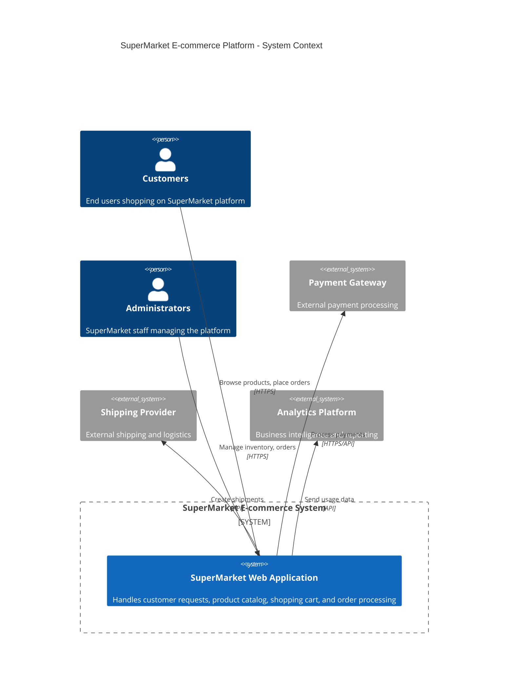
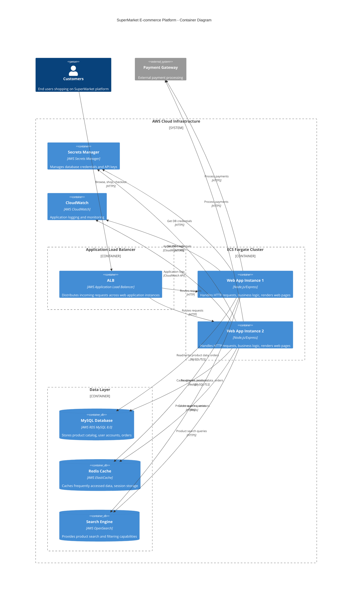
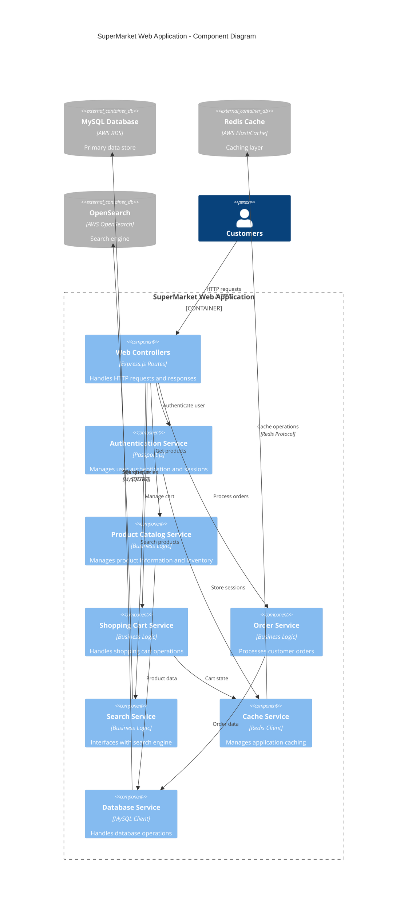
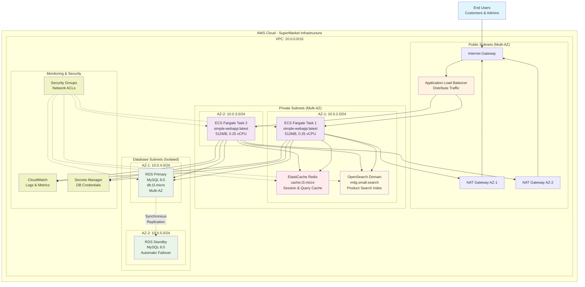

# SuperMarket Cloud Migration - Architecture Documentation

## Overview

This document describes the AWS cloud architecture for SuperMarket's e-commerce platform migration from on-premise infrastructure to a modern, scalable, and resilient AWS-native solution.

## Architecture Principles

### High Availability
- Multi-AZ deployment across 2 availability zones
- RDS Multi-AZ for database redundancy
- Load balancer distributing traffic across multiple ECS tasks

### Security
- Network segmentation with VPC and security groups
- Database isolation in private subnets
- Least privilege access patterns
- Encrypted data at rest and in transit

### Scalability
- Auto-scaling ECS Fargate services
- Elastic infrastructure components
- Managed services reducing operational overhead

### Cost Optimization
- Right-sized instances for workload requirements
- Managed services reducing maintenance costs
- Development/testing appropriate instance types

## System Architecture

### C4 Context Diagram

### C4 Container Diagram

### C4 Component Diagram - Web Application

### AWS Infrastructure Diagram

## Component Details

### Network Architecture

#### VPC Configuration
- **CIDR Block**: 10.0.0.0/16
- **Availability Zones**: 2 AZs for high availability
- **Subnets**:
  - Public Subnets: 10.0.0.0/24, 10.0.1.0/24 (ALB, NAT Gateways)
  - Private Subnets: 10.0.2.0/24, 10.0.3.0/24 (ECS, Cache, Search)
  - Database Subnets: 10.0.4.0/24, 10.0.5.0/24 (RDS - isolated)

#### Security Groups
- **ALB Security Group**: Allows HTTP(80) and HTTPS(443) from internet
- **ECS Security Group**: Allows traffic from ALB on port 80
- **Database Security Group**: Allows MySQL(3306) from ECS only
- **Cache Security Group**: Allows Redis(6379) from ECS only
- **Search Security Group**: Allows HTTPS(443) from ECS only

### Compute Layer

#### ECS Fargate Configuration
- **Cluster**: SupermarketCluster with Container Insights
- **Task Definition**: 
  - CPU: 256 units (0.25 vCPU)
  - Memory: 512 MB
  - Image: `ghcr.io/patrick204nqh/simple-webapp:latest`
- **Service**: 2 desired tasks with auto-scaling across AZs
- **Networking**: Deployed in private subnets with security groups

#### Application Load Balancer
- **Type**: Application Load Balancer (Layer 7)
- **Placement**: Public subnets across multiple AZs
- **Target Group**: ECS tasks with health checks on path "/"
- **Listener**: HTTP on port 80

### Data Layer

#### RDS MySQL Database
- **Engine**: MySQL 8.0
- **Instance Class**: db.t3.micro
- **Deployment**: Multi-AZ for high availability
- **Storage**: 20GB GP2 with automated backups (7 days retention)
- **Security**: Isolated in database subnets, encrypted at rest
- **Credentials**: Managed via AWS Secrets Manager

#### ElastiCache Redis
- **Engine**: Redis
- **Node Type**: cache.t3.micro
- **Deployment**: Single node in private subnet
- **Purpose**: Application caching and session storage

#### OpenSearch Domain
- **Version**: OpenSearch 2.11
- **Instance Type**: m6g.small.search
- **Deployment**: Single node in private subnet
- **Storage**: 20GB EBS GP2
- **Purpose**: Product search and analytics

### Monitoring and Logging

#### CloudWatch Integration
- **Container Insights**: Enabled for ECS cluster monitoring
- **Application Logs**: Streamed to CloudWatch Logs
- **Metrics**: Available for all AWS services
- **Alarms**: Can be configured for critical metrics

#### Built-in Service Monitoring
- **RDS**: Performance Insights and automated monitoring
- **ElastiCache**: Redis metrics and performance monitoring
- **OpenSearch**: Cluster health and performance metrics
- **ECS**: Task and service level metrics

## Security Architecture

### Network Security
- **VPC Isolation**: Complete network isolation from other AWS resources
- **Security Groups**: Act as virtual firewalls with least privilege rules
- **NACLs**: Default allow/deny rules at subnet level
- **Private Subnets**: Application and data tiers not directly accessible from internet

### Data Security
- **Encryption at Rest**: Enabled for RDS, EBS volumes
- **Encryption in Transit**: HTTPS/TLS for all service communications
- **Secrets Management**: Database credentials stored in AWS Secrets Manager
- **IAM Roles**: Task execution roles with minimal required permissions

### Access Control
- **Database Access**: Only from ECS tasks via security groups
- **Cache Access**: Restricted to application tier
- **Search Access**: Limited to application services
- **Administrative Access**: Through AWS IAM and console

## Disaster Recovery and High Availability

### RDS High Availability
- **Multi-AZ Deployment**: Automatic failover to standby instance
- **Automated Backups**: 7-day retention with point-in-time recovery
- **Cross-AZ Synchronous Replication**: Zero data loss failover

### Application High Availability
- **Multi-AZ ECS Deployment**: Tasks distributed across availability zones
- **Load Balancer Health Checks**: Automatic traffic routing to healthy instances
- **Auto Scaling**: Automatic capacity adjustment based on demand

### Recovery Procedures
- **RDS Failover**: Automatic with ~1-2 minutes downtime
- **ECS Task Recovery**: Automatic replacement of failed tasks
- **Regional Disaster**: Manual procedures for cross-region recovery

## Performance Optimization

### Caching Strategy
- **Application-Level Caching**: Redis for database query results
- **Session Management**: Redis for user session storage
- **CDN Integration**: Can be added for static content delivery

### Database Optimization
- **Connection Pooling**: Managed by application
- **Read Replicas**: Can be added for read scaling
- **Query Optimization**: Application-level optimization

### Search Performance
- **OpenSearch Indexing**: Optimized for product search
- **Query Optimization**: Application-level search optimization

## Cost Optimization

### Instance Sizing
- **Development Optimized**: t3.micro and small instances for cost efficiency
- **Production Ready**: Can scale to larger instances as needed
- **Reserved Instances**: Can be utilized for predictable workloads

### Managed Services Benefits
- **Reduced Operational Overhead**: No server management required
- **Automatic Scaling**: Pay for what you use
- **Built-in Security**: Reduces security management overhead

## Migration Path

### From Current State
- **Legacy Infrastructure**: 3 physical Apache servers, single MySQL, Redis on same server
- **Single Point of Failure**: Database server failure affects entire system
- **Limited Scalability**: Manual scaling and maintenance

### To Target State
- **Containerized Applications**: Scalable ECS Fargate deployment
- **Managed Database**: RDS with automatic backups and Multi-AZ
- **Dedicated Services**: Separate caching and search tiers
- **High Availability**: No single points of failure

### Migration Benefits
- **99.9% Uptime**: Multi-AZ redundancy eliminates downtime
- **Auto Scaling**: Handles traffic spikes automatically
- **60% Reduced Maintenance**: Managed services reduce operational overhead
- **Improved Performance**: Dedicated caching and search services

## Deployment and Operations

### Infrastructure as Code
- **AWS CDK**: TypeScript-based infrastructure definition
- **Version Control**: Git-based infrastructure versioning
- **Automated Deployment**: Consistent and repeatable deployments

### Operational Procedures
- **Monitoring**: CloudWatch dashboards and alerting
- **Logging**: Centralized application and infrastructure logs
- **Backup Verification**: Regular backup testing procedures
- **Scaling Procedures**: Manual and automatic scaling processes

### Maintenance Windows
- **RDS Maintenance**: Automated during configured windows
- **ECS Updates**: Rolling deployments with zero downtime
- **Security Patching**: Automatic for managed services

---

This architecture provides SuperMarket with a robust, scalable, and cost-effective e-commerce platform capable of handling current traffic and future growth requirements while maintaining high availability and security standards.