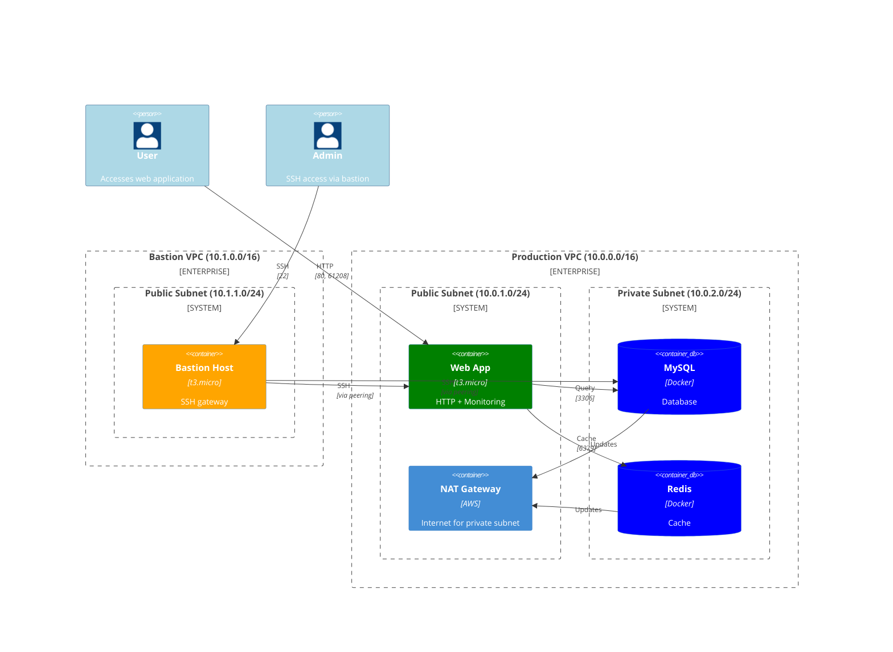

# Architecture Diagram

```mermaid
---
title: Market Practice - Multi-VPC Architecture
---
C4Container
    Person(user, "User", "Accesses web application")
    Person(admin, "Admin", "SSH access via bastion")

    Enterprise_Boundary(bastion_vpc, "Bastion VPC (10.1.0.0/16)") {
        System_Boundary(bastion_public_subnet, "Public Subnet (10.1.1.0/24)") {
            Container(bastion, "Bastion Host", "t3.micro", "SSH gateway")
        }
    }

    Enterprise_Boundary(prod_vpc, "Production VPC (10.0.0.0/16)") {
        System_Boundary(public_subnet, "Public Subnet (10.0.1.0/24)") {
            Container(webapp, "Web App", "t3.micro", "HTTP + Monitoring")
            Container(nat, "NAT Gateway", "AWS", "Internet for private subnet")
        }
        
        System_Boundary(private_subnet, "Private Subnet (10.0.2.0/24)") {
            ContainerDb(mysql, "MySQL", "Docker", "Database")
            ContainerDb(redis, "Redis", "Docker", "Cache")
        }
    }

    Rel(user, webapp, "HTTP", "80, 61208")
    Rel(admin, bastion, "SSH", "22")
    Rel(bastion, webapp, "SSH", "via peering")
    Rel(bastion, mysql, "SSH", "via peering")
    Rel(webapp, mysql, "Query", "3306")
    Rel(webapp, redis, "Cache", "6379")
    Rel(mysql, nat, "Updates")
    Rel(redis, nat, "Updates")

    UpdateElementStyle(user, $bgColor="lightblue")
    UpdateElementStyle(admin, $bgColor="lightblue")
    UpdateElementStyle(webapp, $bgColor="green")
    UpdateElementStyle(mysql, $bgColor="blue")
    UpdateElementStyle(redis, $bgColor="blue")
    UpdateElementStyle(bastion, $bgColor="orange")
```