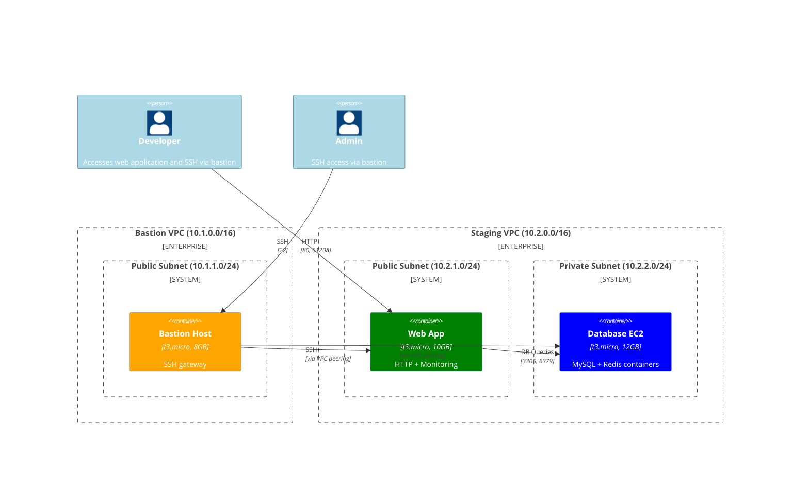
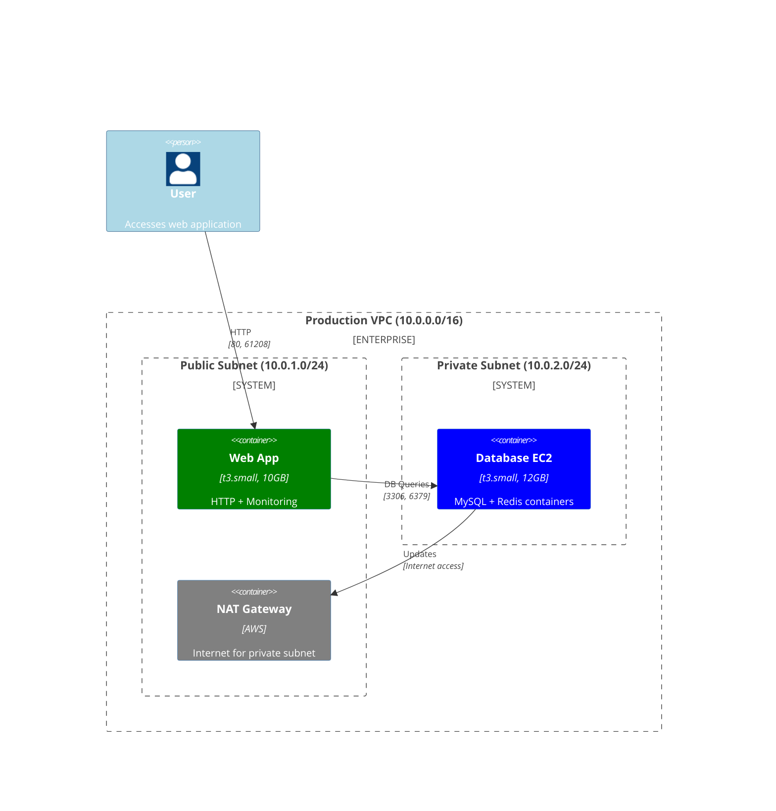

# Architecture Diagrams

This document shows the architecture for both staging and production environments, highlighting their different security and cost optimization approaches.

## Staging Environment Architecture

## Production Environment Architecture

## Environment Comparison

| Feature | Staging | Production |
|---------|---------|------------|
| **VPC Design** | Multi-VPC (App + Bastion) | Single VPC (Isolated) |
| **VPC CIDR** | 10.2.0.0/16 | 10.0.0.0/16 |
| **Bastion Host** | ✅ Deployed (10.1.0.0/16) | ❌ Not deployed |
| **VPC Peering** | ✅ Enabled | ❌ Disabled |
| **NAT Gateway** | ❌ Disabled (cost optimization) | ✅ Enabled (security) |
| **SSH Access** | Via bastion only | Emergency access only |
| **Instance Types** | t3.micro | t3.small |
| **Storage** | Cost-optimized (8-12GB) | Cost-optimized (10-12GB) |

## Security Models

### **Staging Environment (Development Access)**
- **Purpose**: Development, testing, and debugging
- **Access Pattern**: All SSH goes through bastion host
- **Cost Optimization**: No NAT gateway, smaller instances, reduced storage
- **Network**: Multi-VPC with peering for secure access
- **Emergency SSH**: Can be enabled by uncommenting rules in security groups

### **Production Environment (Maximum Isolation)**
- **Purpose**: Production workloads with maximum security
- **Access Pattern**: No SSH access by design (completely isolated)
- **Security**: Single VPC, no bastion, no VPC peering
- **Network**: NAT gateway for private subnet internet access
- **Emergency SSH**: Can be enabled by uncommenting rules in security groups (use with extreme caution)

## Cost Optimization Features

- **Storage**: 50-60% reduction in EBS volumes (8GB bastion, 10GB webapp, 12GB database)
- **NAT Gateway**: Removed from staging (~$45/month savings)
- **Instance Sizing**: Environment-appropriate sizing (micro vs small)
- **Volume Type**: gp3 volumes for better price/performance
- **Resource Tagging**: Comprehensive cost allocation tags