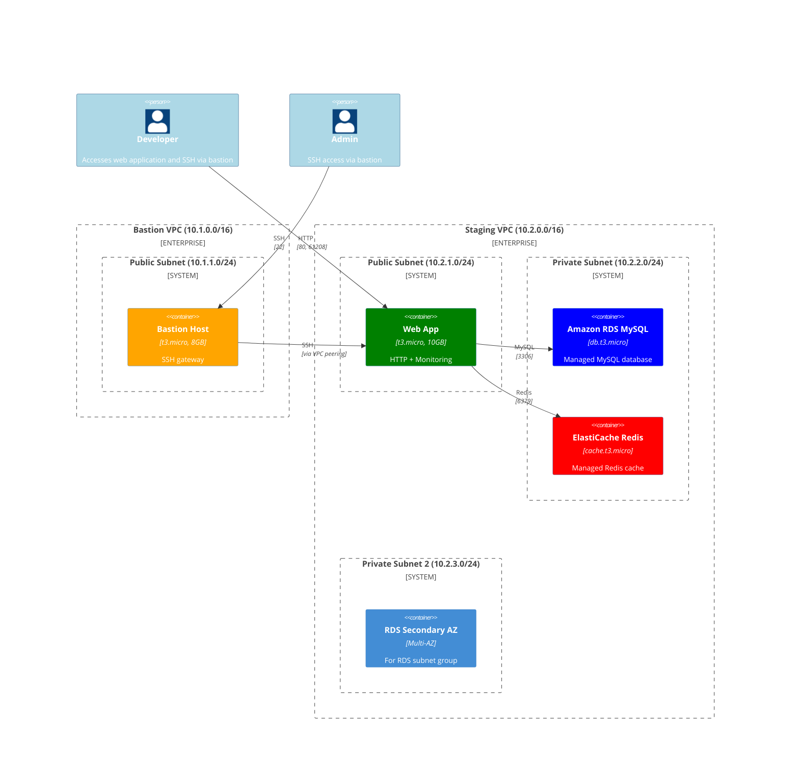
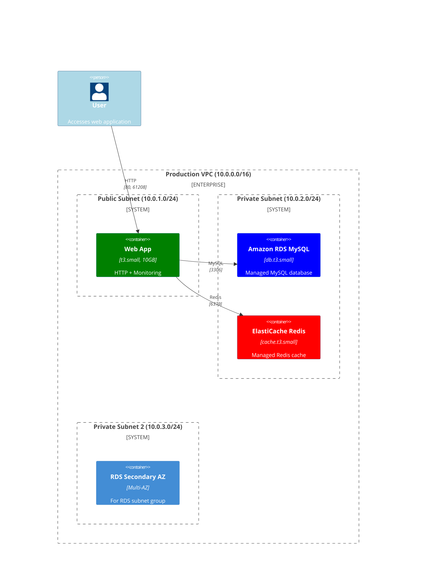

# Architecture Diagrams

This document shows the architecture for both staging and production environments using native AWS managed services (RDS and ElastiCache) instead of EC2-based databases.

## Staging Environment Architecture

## Production Environment Architecture

## Environment Comparison

| Feature | Staging | Production |
|---------|---------|------------|
| **VPC Design** | Multi-VPC (App + Bastion) | Single VPC (Isolated) |
| **VPC CIDR** | 10.2.0.0/16 | 10.0.0.0/16 |
| **Bastion Host** | ✅ Deployed (10.1.0.0/16) | ❌ Not deployed |
| **VPC Peering** | ✅ Enabled | ❌ Disabled |
| **NAT Gateway** | ❌ Not needed (managed services) | ❌ Not needed (webapp in public subnet) |
| **SSH Access** | Via bastion only | Emergency access only |
| **Database** | RDS MySQL (db.t3.micro) | RDS MySQL (db.t3.small) |
| **Cache** | ElastiCache Redis (cache.t3.micro) | ElastiCache Redis (cache.t3.small) |
| **Multi-AZ** | Single AZ (cost optimization) | Multi-AZ (high availability) |
| **Backup Retention** | 1 day | 7 days |

## Security Models

### **Staging Environment (Development Access)**
- **Purpose**: Development, testing, and debugging
- **Access Pattern**: All SSH goes through bastion host
- **Database Services**: Single-AZ RDS and ElastiCache for cost optimization  
- **Network**: Multi-VPC with peering, no NAT gateway needed (managed services)
- **Emergency SSH**: Can be enabled by uncommenting rules in security groups

### **Production Environment (Maximum Isolation)**
- **Purpose**: Production workloads with maximum security
- **Access Pattern**: No SSH access by design (completely isolated)
- **Database Services**: Multi-AZ RDS with extended backup retention
- **Security**: Single VPC, no bastion, no VPC peering
- **Network**: Simple architecture with webapp in public subnet, databases in private subnets
- **Emergency SSH**: Can be enabled by uncommenting rules in security groups (use with extreme caution)

## Cost Optimization Features

### **EC2 Instances**
- **Storage**: Reduced EBS volumes (8GB bastion, 10GB webapp)
- **Instance Sizing**: Environment-appropriate sizing (micro vs small)
- **Volume Type**: GP3 volumes for better price/performance

### **Managed Services**
- **RDS**: Right-sized instances (db.t3.micro vs db.t3.small)
- **ElastiCache**: Single-node staging vs multi-node production
- **Multi-AZ**: Disabled in staging for cost savings
- **Backup Retention**: Minimal retention in staging (1 day vs 7 days)
- **Resource Tagging**: Comprehensive cost allocation tags

### **Network**
- **NAT Gateway**: Completely eliminated (~$90/month total savings across both environments)
- **Architecture**: Simple design with webapp in public subnets, databases in private subnets
- **Data Transfer**: Optimized with private subnets for database traffic

## Native AWS Services Benefits

### **Amazon RDS MySQL**
- **Zero Downtime**: Automated patching and maintenance
- **Backup & Recovery**: Point-in-time recovery and automated backups
- **Security**: Encryption at rest and in transit, network isolation
- **Monitoring**: Built-in CloudWatch metrics and Performance Insights
- **Scalability**: Easy vertical and horizontal scaling

### **Amazon ElastiCache Redis**
- **High Performance**: Sub-millisecond latency with in-memory caching
- **High Availability**: Automatic failover and data replication
- **Security**: VPC isolation, encryption, and access control
- **Monitoring**: Real-time metrics and performance monitoring
- **Cost Effective**: Pay-as-you-use with no upfront costs

This architecture eliminates the operational overhead of managing database EC2 instances while providing enterprise-grade reliability and security.